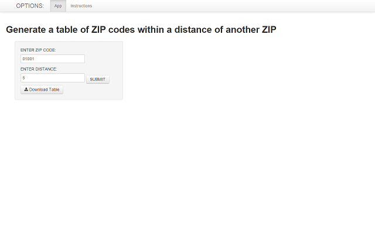
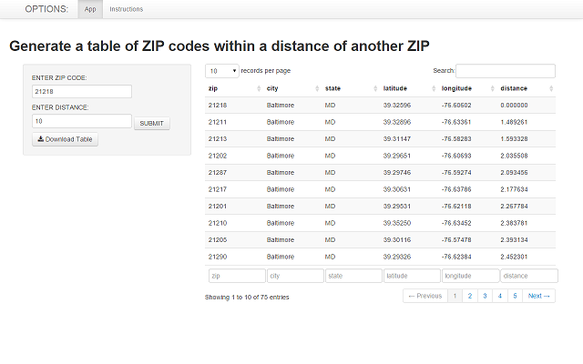

```{r,echo=FALSE}
library(zipcode)
data(zipcode)
```
The ZIPTABLE app generates a table of US ZIP codes that are within an "x" mile radius of another, user-entered, ZIP code.  Distances are calculated based on the latitude and longitude geocodes of ZIP code centroids, as defined in the R "zipcode" dataframe.

The "zipcode" dataframe has the following structure:
```{r,echo=FALSE}
str(zipcode)
```

Here is a small sample of the data:
```{r,echo=FALSE}
head(zipcode,5)
```
When you browse to the ZIPTABLE app, you are presented with a simple interface through which to enter the desired 5-character ZIP code, as well as the desired radius, in miles:



Enter the desired ZIP code and distance, then click the "SUBMIT" button.  The app will generate a table that you can search, sort, and scroll through,  You also have the option to download the table as a ".csv" file, by clicking the "Download Table" button:



Thank you for trying the ZIPTABLE app!