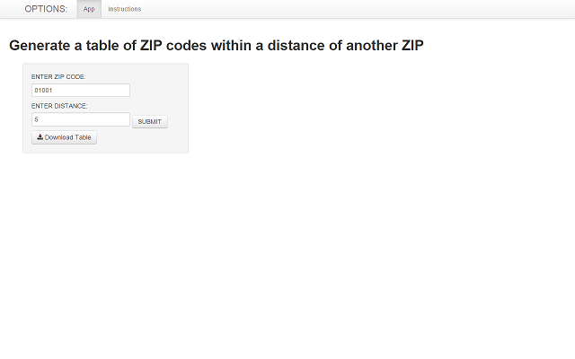

# ZIPTABLE app Instructions

The ZIPTABLE app generates a table of US ZIP codes that are within an "x" mile radius of another, user-entered, ZIP code.  Distances are calculated based on the latitude and longitude geocodes of ZIP code centroids, as defined in the R "zipcode" dataframe.

The "zipcode" dataframe has the following structure:

```
## 'data.frame':	44336 obs. of  5 variables:
##  $ zip      : chr  "00210" "00211" "00212" "00213" ...
##  $ city     : chr  "Portsmouth" "Portsmouth" "Portsmouth" "Portsmouth" ...
##  $ state    : chr  "NH" "NH" "NH" "NH" ...
##  $ latitude : num  43 43 43 43 43 ...
##  $ longitude: num  -71 -71 -71 -71 -71 ...
```

Here is a small sample of the data:

```
##     zip       city state latitude longitude
## 1 00210 Portsmouth    NH    43.01    -71.01
## 2 00211 Portsmouth    NH    43.01    -71.01
## 3 00212 Portsmouth    NH    43.01    -71.01
## 4 00213 Portsmouth    NH    43.01    -71.01
## 5 00214 Portsmouth    NH    43.01    -71.01
```
When you browse to the ZIPTABLE app, you are presented with a simple interface through which to enter the desired 5-character ZIP code, as well as the desired radius, in miles:



Enter the desired ZIP code and distance, then click the "SUBMIT" button.  The app will generate a table that you can search, sort, and scroll through,  You also have the option to download the table as a ".csv" file, by clicking the "Download Table" button:


Thank you for trying the ZIPTABLE app!
